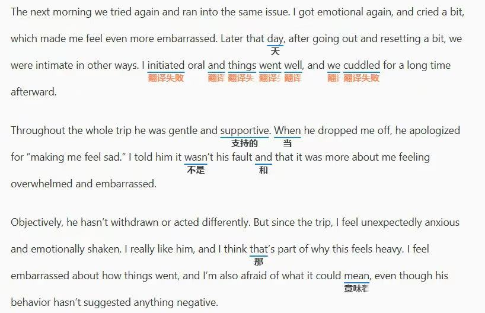

# [BUG] 句子中的单词翻译一直提示”翻译失败” (Issue #19)

| Metadata | Value |
| :--- | :--- |
| Status | OPEN |
| Author | hongyuan007 |
| Date | 2026-02-26 |
| Labels | bug |
| URL | https://github.com/hongyuan007/tapword-translator/issues/19 |

## Description 问题描述
网页中的部分句子中的单词翻译一直提示”翻译识别”，但是其他句子中的单词翻译正常

## URL 发生问题的网址
https://www.reddit.com/r/dating_advice/comments/1rdet1l/first_time_having_sex_with_new_boyfriend_didnt_go/

## Screenshots 截图

## Environment 环境信息
- Chrome
- Extension Version 0.4.0

## Comments
(No comments)
