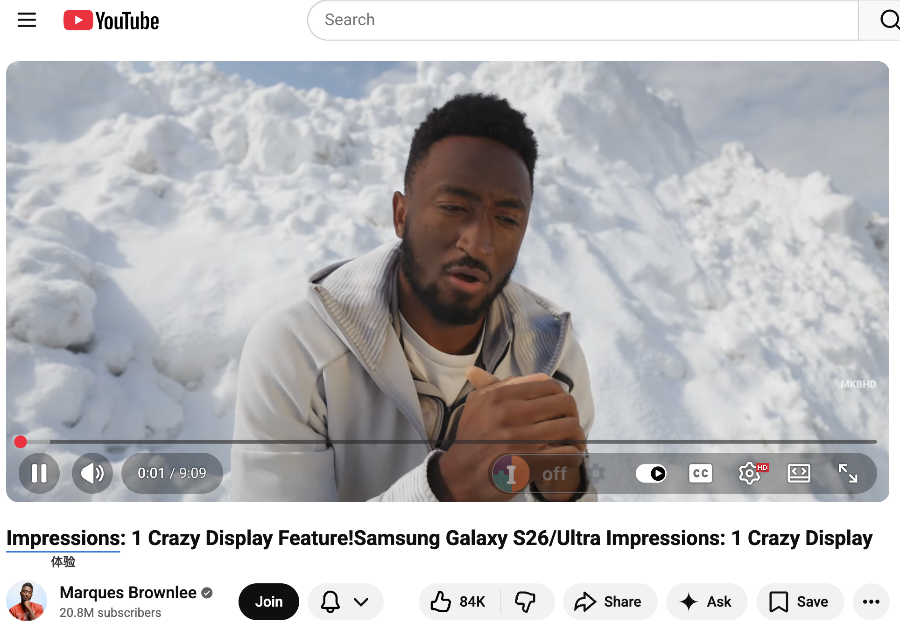
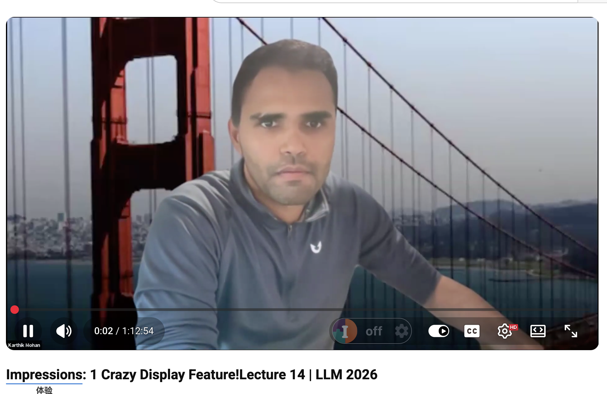

# [BUG] youtube视频标题翻译，切换到下一个视频后，前一个视频的翻译没有消失 (#20)

| Metadata | Value |
| --- | --- |
| **Status** | Open |
| **Author** | [hongyuan007](https://github.com/hongyuan007) |
| **Created** | 2026-02-26T06:44:29Z |
| **Updated** | 2026-02-26T06:44:29Z |
| **Labels** | bug |
| **URL** | https://github.com/hongyuan007/tapword-translator/issues/20 |

## Description

**Description 问题描述**
翻译一个youtube视频的标题，然后切换到下一个视频，第二个视频的标题包含上一个视频的翻译内容

**URL 发生问题的网址**
https://www.youtube.com/watch?v=c-YzRCghWVA

**Screenshots 截图**

**Environment 环境信息**
- Browser: Chrome
- Extension Version: 0.4.0

## Comments

*No comments.*

## Problem Analysis (Root Cause)

**问题根因分析：**
这是一个典型的在单页应用（SPA，如 YouTube）中，因扩展程序修改 DOM 结构与目标网站动态渲染机制冲突导致的 Bug。

1. **DOM 结构被修改**：当用户在第一个视频页翻译标题时，扩展程序会将纯文本节点替换或包裹为自定义的 DOM 结构（如包含原文、译文和交互状态的组件）。
2. **SPA 动态路由刷新机制**：当用户点击下一个视频时，YouTube 并没有刷新整个页面（Full Page Reload），而是通过 JavaScript 拦截路由变化，并尝试直接更新现有 DOM 节点（通常是通过修改 `textContent` 或内部文本节点）来替换为新视频的标题。
3. **更新失效与残留**：由于扩展程序已经改变了原有的 DOM 结构（例如，原本是一个完整的 text node，现在变成了多个 span 或自定义元素），YouTube 原生的更新脚本可能：
   - 只更新了原本存在或新追加的某个文本片段，而没有清理掉扩展注入的 HTML 节点。
   - 导致旧的翻译片段和新的视频标题被拼接在了一起（如截图中展示的：旧标题片段 + 旧翻译 + 新标题）。

**核心挑战：** 需要一种机制，在 SPA 动态更新目标节点（或路由发生变化）时，能够自动还原被翻译过的 DOM 结构，或者侦测到外部对 DOM 的修改并及时清理无效的翻译层。

## Technical Solution (技术方案)

**方案思路：主动监听“页面切换”，强制清理残留翻译。**

针对 SPA（如 YouTube）中切换页面导致 DOM 残留的问题，我们的核心策略是：**在 Content Script 中监听页面的实质性导航（如视频切换、文章跳转），并在导航发生时主动清理所有注入的翻译 DOM。**

### 为什么单纯监听 URL 变化有风险？

正如你所担心的，仅仅监听 URL 的 `hash` 变化（例如从 `page.html#section1` 跳到 `page.html#section2`）或者简单的 `pushState`，确实**不够精确**，很容易导致“误杀”。
*   **误杀场景**：用户正在看长文章，翻译了第一段的一个词。然后点击了侧边栏的“目录”，页面滚动到第三段，URL 变成了 `...#section3`。如果这个时候我们粗暴地认为“URL 变了就是换页了”，把第一段的翻译清除了，用户的体验会非常糟糕。

### 更精确的监听逻辑：URL Path/Query 变化 + 核心 DOM 变化

为了避免误杀（比如页面内的锚点跳转），我们需要更精确地定义什么是“实质性的页面切换”。对于 YouTube 等视频或内容网站，实质性切换通常意味着：**URL 的核心部分（路径或关键参数）发生了改变。**

因此，我们的监听逻辑需要更加严谨：

**逻辑 1：过滤掉纯 Hash（锚点）跳转**
*   当检测到 URL 变化时，对比旧 URL 和新 URL。
*   如果**只有** `#` 后面的部分（`hash`）变了，说明这只是页面内的锚点滚动，**不触发清理**。
*   如果 `pathname`（如 `/watch` 到 `/channel`）或关键的 `search` 参数（如 YouTube 的 `?v=xxxx` 视频 ID）变了，这才是真正的页面切换，**触发清理**。

**逻辑 2：基于 `MutationObserver` 的双重保险 (推荐的主力方案)**
考虑到现代前端框架的复杂性，最稳妥、最通用的感知 SPA 页面更替的方法是监听 `<title>` 标签的变化，并辅以 URL 核心部分的校验。

1.  **初始化观察者**：在 `1_content/index.ts` 中，创建一个 `MutationObserver`，专门盯着 `<head>` 里的 `<title>` 元素。
2.  **记录基准线**：进入页面时，记录当前的完整 URL（排除 hash）。
3.  **触发判定**：
    *   当原网站的 JS 修改了 `<title>` 的文本（意味着内容主题变了，比如从“视频 A”变成了“视频 B”）。
    *   此时，我们立即检查当前的 `window.location.href`（忽略 hash 部分）是否与之前记录的基准线不同。
    *   **如果两者都变了（Title 变了 && 核心 URL 变了）**，我们就有 99% 的把握认为：用户切换了视频或文章。
4.  **执行清理**：
    *   调用 `removeAllTranslationResults()`。
    *   遍历所有存活的翻译 `anchor`，执行解包（unwrap，去掉 span）操作，将目标区域恢复为纯净的文本节点。
    *   销毁所有挂载在 `document.body` 上的浮动气泡（Tooltip）。
5.  **更新基准线**：将新的核心 URL 记录为下一次判定的基准线。

### 总结

这套方案**不会**因为用户点击了页面内的目录锚点（只改变 `#`）而误删翻译。它通过“标题改变 + 核心路径改变”的双重特征，精准捕捉 SPA 网站（特别是 YouTube 这类改变 `?v=` 参数的网站）的视频/页面切换动作，从而在最恰当的时机执行“拔除 span、打扫战场”的清理工作，彻底解决翻译残留和新旧标题拼接的 Bug。
