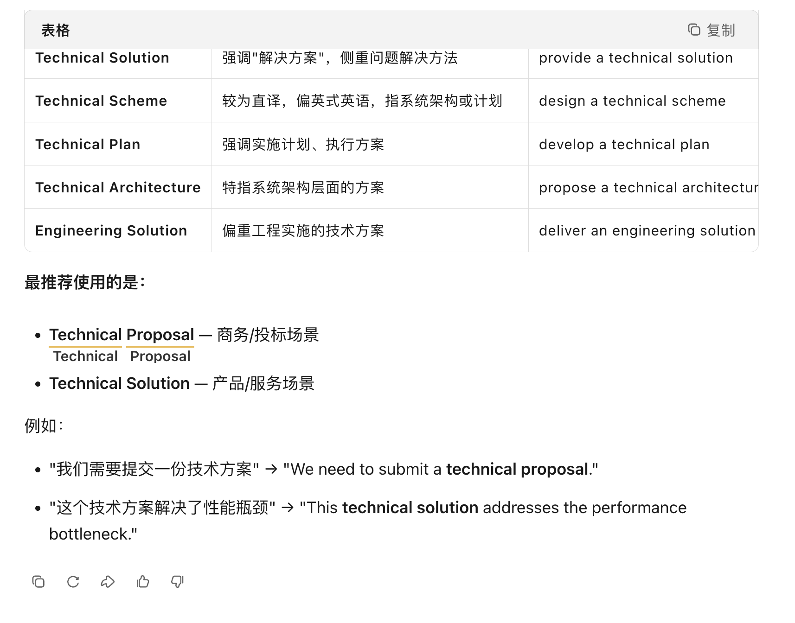

# [BUG] 包含中文和英文网页，单词翻译还是英文的 (#24)

| Status | Author | Date | Labels | URL |
| :--- | :--- | :--- | :--- | :--- |
| OPEN | hongyuan007 | 2026-02-27 | bug | [Link](https://github.com/hongyuan007/tapword-translator/issues/24) |

## Description 问题描述

翻译中文网页内容中的英文单词，翻译输出的还是英文

**URL 发生问题的网址**

**Screenshots 截图**

**Environment 环境信息**
- Browser: Chrome
- Extension Version: 0.4.0

## Comments

No comments.
