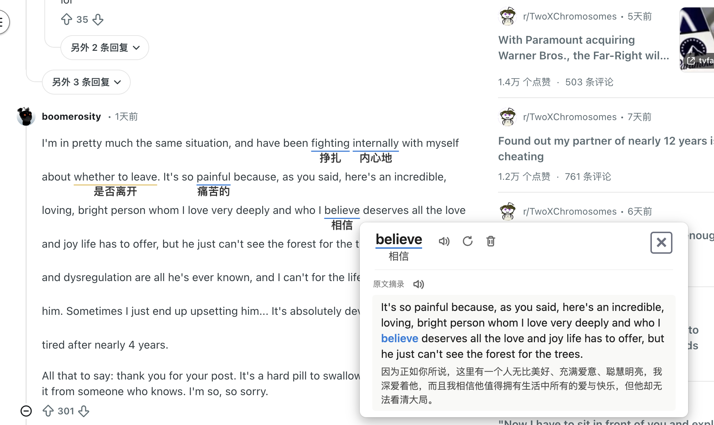

# [BUG] 单词翻译，详情页中没有词典和音标数据 (#29)

| Field    | Value                                                                 |
|----------|-----------------------------------------------------------------------|
| Status   | OPEN                                                                  |
| Author   | Eric Zhang (@hongyuan007)                                             |
| Created  | 2026-03-04                                                            |
| Labels   | `bug`                                                                 |
| URL      | https://github.com/hongyuan007/tapword-translator/issues/29          |

---

## Description 问题描述

点击单词翻译，弹出的详情页弹窗，没有音标和词典释义

## URL 发生问题的网址

https://www.reddit.com/r/TwoXChromosomes/comments/1rjf10c/ending_my_relationship_with_the_best_man_ive_ever/

## Screenshots 截图

用户截图（v0.4.1，单词 "believe"，词典/音标缺失）：



用户粘贴补充截图：


## Environment 环境信息

- Browser: Chrome
- Extension Version: 0.4.1

---

## Comments

*No comments.*

---

## Bug Analysis 问题分析

### 现象

截图 2 中，单词 "believe" 的详情弹窗展示了：
- ✅ 单词翻译（相信）
- ✅ 原文摘录及句子翻译
- ❌ **音标缺失**（期望：`/bɪˈliːv/`）
- ❌ **词典释义缺失**（期望：英汉词典内容）

### 数据流路径

```
API Response
  → TranslationService (src/6_translate/services/TranslationService.ts)
  → BackgroundHandler (src/2_background/handlers/TranslationRequestHandler.ts)
  → TranslationPipeline (src/1_content/handlers/TranslationPipeline.ts)
  → translationDisplay.updateTranslationResult (stores in translationDataMap)
  → modal opens → modalTemplates.renderSuccessTemplate
```

### 前端显示逻辑（src/1_content/ui/modalTemplates.ts）

```typescript
// 音标
let phoneticText = ""
if (data.phonetic) {
    phoneticText = `/${data.phonetic}/`
}

// 词典
const isChinese = data.targetLanguage === "zh"
const dictionaryContent = isChinese ? data.chineseDefinition : data.targetDefinition
if (dictionaryContent) {
    dictionarySection = createDictionarySection(...)
}
```

前端逻辑正确：对中文目标语言优先展示 `chineseDefinition`，`phonetic` 非空才显示。

### 根本原因

前端数据链路经过 code review 确认完整无误。问题是 **后端 API 响应中 `phonetic` 和 `chineseDefinition` 字段缺失**。

根据 API 文档，这两个字段的返回条件为：
> `phonetic`、`chineseDefinition`：**Optional: only present for single English words.**

"believe" 是单个英文词，理论上应该返回这两个字段。后端 ECDICT / WordNet 查询对该词未能返回结果（可能是查询异常被静默捕获，或 dictionary lookup 返回空）。

### 需要后端排查的方向

1. ECDICT 词典中 "believe" 的查询结果是否正常
2. WordNet lookup 是否对该词有异常
3. 后端日志中对应请求是否有 `chineseDefinition` 字段
4. 是否特定词（高频词、动词等）在 ECDICT 中 lemma 处理有问题（如 "believes" → "believe" 的 lemma 后词典命中失败）
