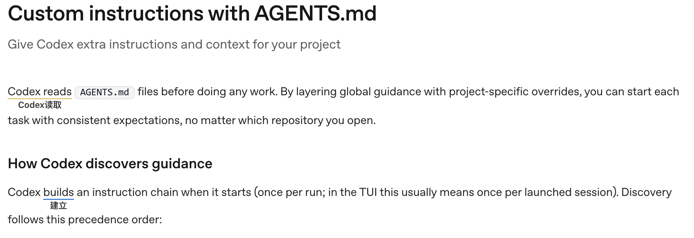
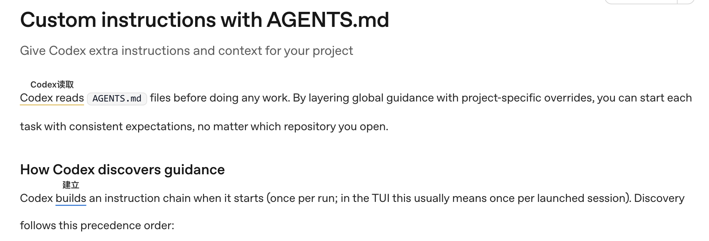

# [BUG] codex文档网页，悬浮翻译会随着页面滑动发生漂移 #35

| Status | Author | Date | Labels | URL |
| :--- | :--- | :--- | :--- | :--- |
| OPEN | hongyuan007 | 2026-03-07 | bug | [View on GitHub](https://github.com/hongyuan007/tapword-translator/issues/35) |

**Description 问题描述**
悬浮翻译会随着页面滑动，逐渐漂移

**URL 发生问题的网址**
https://developers.openai.com/codex/guides/agents-md/#create-global-guidance

**Screenshots 截图**
初始状态

往下滑动内容

**Environment 环境信息**
- Browser: Chrome
- Extension Version: 0.4.1

## Comments
